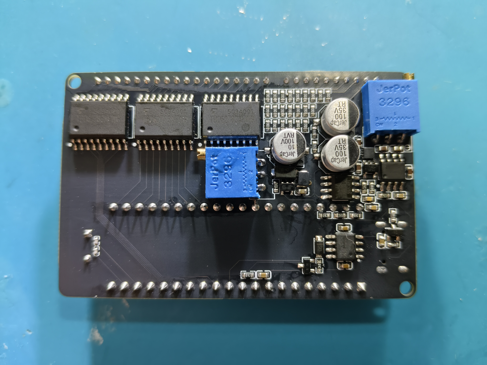

[简体中文](README_zh-CN.md)

# vfd-test

An open-source VFD test board based on the **STC89C52RC**. It drives an 8-digit, 14-segment VFD, accepts text over USB serial, and keeps the power, high-voltage drive, and display-scanning circuitry on one board.

<p align="center">
  
  
</p>

<p align="center"><em>Left: VFD operating. Right: board underside with the driver and power circuits.</em></p>

## Overview

The signal path is straightforward: USB-C → CH340N → STC89C52RC → TBD62783AFG → VFD. The MCU scans eight display positions and receives printable ASCII characters over serial. The CH340N RTS signal also drives the on-board automatic cold-start circuit, allowing STC-ISP to program the MCU without manual power cycling.

## Features

- 8-digit, 14-segment VFD with a built-in printable-ASCII font table
- Three TBD62783AFG driver arrays for the VFD grids and anode lines
- USB-C serial interface through a CH340N
- Default serial format: `9600 8N1`
- RTS-controlled automatic cold-start circuit for one-click STC-ISP programming
- Grid/anode boost supply and a dedicated filament driver on the same board

## Hardware

| Function | Part |
| --- | --- |
| MCU | STC89C52RC-40I-PDIP40 |
| USB-to-serial bridge | CH340N |
| VFD drivers | TBD62783AFG × 3 |
| Grid/anode boost converter | LMR64010 |
| Filament driver | DRV8837 |
| Crystal | 11.0592 MHz |
| Display | D1319WF, 8-digit 14-segment VFD |

## Electrical operating points

The following settings were measured to work well with this board and tube. They are reference values rather than universal ones; re-measure and adjust them when using a different VFD or power circuit.

- Voltage across the two filament terminals: approximately **2 Vrms**
- Grid and anode voltage relative to system ground: approximately **30 V**
- Average voltage difference between the grids/anodes and the filament: approximately **25 V**

The 25 V value is neither the voltage across the filament nor the filament-to-ground voltage. It is the average voltage difference between the grids/anodes and the filament. The filament drive waveform has an approximately 5 V DC bias relative to system ground; with the grids and anodes at 30 V, this produces an average difference of about 25 V and helps reduce VFD ghosting. During debugging, distinguish between the voltage across the filament, the filament-to-ground voltage, and the average grid/anode-to-filament voltage difference.

## Safety

> **Warning**
>
> The boost converter gets hot and its output capacitors can remain charged after power-off. Do not touch the grids, anodes, filament driver, or related test points while the board is operating.
>
> The human body conducts electricity. Touching the circuit can conduct grid/anode voltage through the body to the MCU and make it behave abnormally. It can also conduct voltage into the LDO that supplies the filament, raising the filament voltage and, in a serious case, making the filament glow red. Turn the board off and let the capacitors discharge fully before measuring or rewiring it. When using an oscilloscope, pay close attention to the probe ground-clip connection.

## Quick start

### 1. Build and flash

The firmware is developed as a Keil C51 project:

```text
vfd-test-firmware/vfd-test-firmware.uvproj
```

After building, the generated HEX file is located at:

```text
vfd-test-firmware/Objects/vfd-test-firmware.hex
```

Flash it with an STC89C52RC-compatible programmer. The CH340N RTS signal is connected to the automatic cold-start circuit, so STC-ISP can enter programming mode, erase, and program the MCU with one click—no manual power cycling is required.

### 2. Send text over serial

On Linux, minicom can be used as follows:

```bash
minicom -D /dev/ttyUSB0 -b 9600
```

| Setting | Value |
| --- | --- |
| Baud rate | 9600 |
| Data bits | 8 |
| Parity | None |
| Stop bits | 1 |
| Flow control | None |

Each received printable ASCII character is appended to the display buffer, shifting existing text one position to the left. Terminal echo is controlled by the terminal program; the firmware does not echo characters back to the host.

## Display mapping

### Seven-segment portion

| Segment | VFD pin |
| --- | --- |
| a | P4 |
| b | P3 |
| c | P14 |
| d | P5 |
| e | P6 |
| f | P11 |
| g (left half) | P12 |
| g (right half) | P13 |

### Starburst and center vertical segments

| Position | VFD pin |
| --- | --- |
| Upper-left diagonal | P10 |
| Lower-left diagonal | P7 |
| Lower-right diagonal | P9 |
| Upper-right diagonal | P2 |
| Upper center vertical | P1 |
| Lower center vertical | P8 |

The MCU-to-VFD connections are:

- `P3.7–P3.2` correspond to VFD `P14–P9`
- `P2.7–P2.0` correspond to VFD `P1–P8`

The 95-character printable-ASCII font table is in [`vfd-test-firmware/main.c`](vfd-test-firmware/main.c). Update that file if the segment wiring changes.

## Repository layout

```text
.
├── vfd-test-firmware/       # Keil C51 project and STC89C52RC firmware
│   ├── main.c
│   └── Objects/              # Generated HEX and other build files
├── vfd-test-pcb/             # Schematic project, backups, and schematic PDF
├── vfd_top.jpg               # Operating board, top side
├── vfd_bottom.jpg            # Board underside
└── LICENSE                   # MIT License
```

## Ideas for future work

- Add brightness control and a display-enable switch
- Add more font variants or a Chinese dot-matrix extension
- Split the font table and display scanner into reusable modules
- Improve boost/filament-driver efficiency, thermal performance, and EMI
- Add more test points and an enclosure

## License

This project is released under the [MIT License](LICENSE). You are free to use, modify, and redistribute it, provided that the original copyright and license notices are retained. See the `LICENSE` file for the complete terms.
