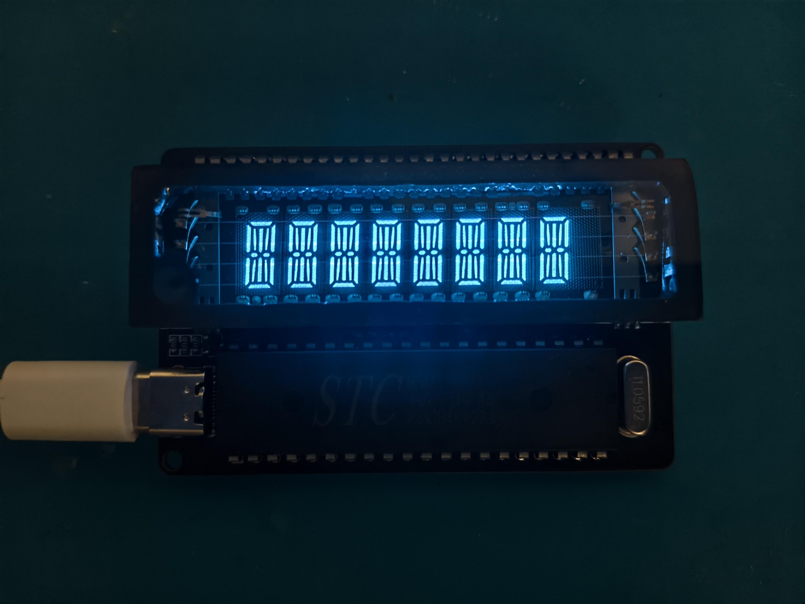

[简体中文](README_zh-CN.md)

# vfd-test

This is a small project for driving an 8-digit, 14-segment VFD with an **STC89C52RC**.

The original goal was simple: build a VFD test board that lights up, displays characters, and accepts text over a USB serial port. The hardware has been assembled and verified, so the firmware, schematics, and related files are shared here for anyone interested in VFDs, boost converters, and classic 8051 microcontrollers.



## What it can do

- Drive an 8-digit, 14-segment VFD
- Use three TBD62783AFG driver arrays for the VFD grid and anode lines
- Scan the display and receive serial data with an STC89C52RC
- Provide a USB serial port through a CH340N and USB-C connector
- Include an RTS-controlled automatic cold-start circuit for one-click programming with STC-ISP
- Use `9600 8N1` as the default serial format
- Receive ASCII characters and scroll them to the left using the built-in font table

In short: plug in USB, flash the firmware, open a serial terminal, and start typing.

## Repository layout

```text
.
├── vfd-test-firmware/       # Keil C51 project and STC89C52RC firmware
│   ├── main.c
│   └── Objects/              # Generated HEX and other build files
├── vfd-test-pcb/             # Schematic project, backups, and schematic PDF
├── vfd.jpg                   # Photo of the assembled board
└── LICENSE                   # MIT License
```

## Hardware overview

The main parts include:

- MCU: STC89C52RC-40I-PDIP40
- USB-to-serial bridge: CH340N
- VFD drivers: TBD62783AFG × 3
- Grid/anode boost converter: LMR64010
- Filament driver: DRV8837
- 8051 crystal: 11.0592 MHz
- Display: 8-digit, 14-segment VFD (D1319WF in this project)

## Voltage settings

These working points turned out to be suitable for this board and tube. They are starting points rather than universal values, so re-measure and adjust them when using a different VFD or power circuit.

- Voltage across the two filament terminals: approximately **2 Vrms**
- Grid and anode voltage relative to system ground: approximately **30 V**
- Average voltage difference between the grids/anodes and the filament: approximately **25 V**

The 25 V value is neither the voltage across the filament nor the filament-to-ground voltage. It is the average voltage difference between the grids/anodes and the filament. The filament drive waveform has an approximately 5 V DC bias relative to system ground; with the grids and anodes at 30 V, this produces an average difference of about 25 V and helps reduce VFD ghosting. During debugging, distinguish between the voltage across the filament, the filament-to-ground voltage, and the average grid/anode-to-filament voltage difference.

The boost section gets hot during operation, and its output capacitors can remain charged. Turn the board off and allow the capacitors to discharge fully before probing or changing the wiring.

## VFD segment and pin mapping

### Conventional seven-segment part

| Segment | VFD pin |
| --- | --- |
| a | P4 |
| b | P3 |
| c | P14 |
| d | P5 |
| e | P6 |
| f | P11 |
| g (left half) | P12 |
| g (right half) | P13 |

### Starburst and center vertical segments

| Position | VFD pin |
| --- | --- |
| Upper-left diagonal | P10 |
| Lower-left diagonal | P7 |
| Lower-right diagonal | P9 |
| Upper-right diagonal | P2 |
| Upper center vertical | P1 |
| Lower center vertical | P8 |

The corresponding MCU connections are:

- `P3.7–P3.2` correspond to VFD `P14–P9`
- `P2.7–P2.0` correspond to VFD `P1–P8`

The font table is in [`vfd-test-firmware/main.c`](vfd-test-firmware/main.c). If the segment wiring changes, this is the main file to update.

## Using the firmware

After startup, the firmware continuously scans all eight display positions. Each character received over serial is inserted into the display buffer, shifting the existing text one position to the left.

On Linux, minicom can be used as follows:

```bash
minicom -D /dev/ttyUSB0 -b 9600
```

The serial settings are:

```text
Baud rate: 9600
Data bits: 8
Parity: None
Stop bits: 1
Flow control: None
```

Whether typed characters are echoed is controlled by the terminal program. The firmware receives characters and displays them; it does not promise to echo them back to the host.

## Building and programming

The firmware is developed as a Keil C51 project. Open:

```text
vfd-test-firmware/vfd-test-firmware.uvproj
```

After building, the generated HEX file can be found at:

```text
vfd-test-firmware/Objects/vfd-test-firmware.hex
```

Use an STC89C52RC-compatible programmer to flash the HEX file. The USB-to-serial bridge's RTS signal is connected to an automatic cold-start circuit, so STC-ISP can enter programming mode, erase, and program the MCU with one click—no manual power cycling required.

If you use a different programmer, its cold-start and serial connections may be different. Follow that programmer's instructions.

## Ideas for future work

- Add brightness control and a display enable switch
- Add a more complete Unicode or Chinese dot-matrix extension
- Split the font table and display scanner into reusable modules
- Improve boost and filament-driver efficiency, thermal performance, and EMI
- Add test points and an enclosure to the PCB

## Safety notes

This is a first-revision experimental board. Its parameters and layout were tuned around the VFD used in this project. Although the VFD supply is only in the tens of volts, the boost converter, storage capacitors, and drive waveforms can still cause burns, shorts, or component damage.

Do not touch the grids, anodes, filament driver, or related test points while the circuit is operating. The human body conducts electricity: touching the circuit can conduct grid/anode voltage through the body to the MCU and make it behave abnormally. It can also conduct voltage into the LDO that supplies the filament, raising the filament voltage and, in a serious case, making the filament glow red. Power the board off and let the capacitors discharge fully before measuring or rewiring it. When using an oscilloscope, pay close attention to where the probe ground clip is connected.

If you recreate this board, adjust the filament voltage, grid/anode voltage, and current-limiting values for the VFD you use.

## License

This project is released under the [MIT License](LICENSE). You are free to use, modify, and redistribute it, provided that the original copyright and license notices are retained. See the `LICENSE` file for the complete terms.
